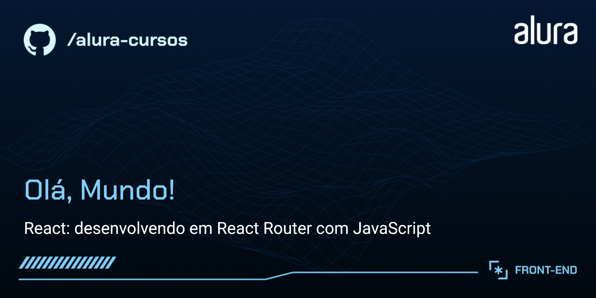

# "Olá, Mundo!"

> Do curso da Alura:
React: desenvolvendo em React Router com JavaScript

O "Olá, Mundo!" é um blog com postagens sobre assuntos relacionados à Tecnologia.
Trat-se de uma SPA (Single Page Application), com diversas páginas.

## 🔨 Funcionalidades do projeto

O aplicativo permite ao visitante ler posts, navegar entre o conteúdo da página, encontrar material sugerido em outros posts e redirecionar o usuário caso caia em alguma página não encontrada.
As diversas páginas desta SPA são atingidas por rotas criadas através do React-Router-Dom, com algumas funcionalidades:

- BrowserRouter, Routes e Route do React-Router-Dom;
- Link e NavLink;
- Outlet;
- rotas aninhadas;
- rotas dinâmicas;
- tratamento para páginas não encontradas;
- hooks (useLocation, useParams, useNavigate).

Realizei este projeto através do Vite, e não do create-react-app, e foram feitos ajustes com relação a algumas rotas. Acrescentei também um botão de 'Voltar ao topo da página' nas páginas de Posts, pois acredito que isso melhora a experiência do usuário após ler textos longos, já que o menu de navegação para as páginas 'Início' e 'Sobre Mim' ficam no topo da mesma.

## ✔️ Tecnologias utilizadas

As tecnologias utilizadas pra isso foram:

-  : construção do conteúdo da página
-  : estilização da página e responsividade
-  : interatividade da página
-  : desenvolvimento dos diversos componentes da página
-  : roteamento das páginas
-  : estrutura do projeto
-  : instalação e manutenção de dependências
-  : instalação e manutenção de dependências
-  : fonte do projeto UI / UX
-  : controle de versão
-  : repositório do código
-  : hospedagem do site
-  : IDE
-  : pesquisa de conteúdo
-  : pesquisa de conteúdo através de IA
-  : pesquisa de conteúdo através de IA
-  : pesquisa de conteúdo através de IA
-  : verificação de dependências
-  : web browser
-  : web browser
-  : web browser
-  : web browser

## 📁 Acesso ao projeto

Você pode acessar o resultado do projeto no [Vercel](https://ola-mundo-blond-three.vercel.app/).
